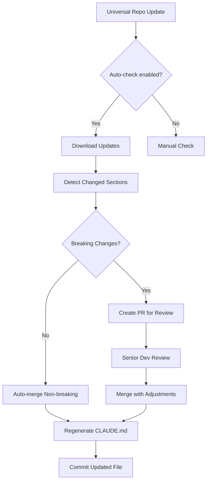

# Tiered CLAUDE.md System - Architecture Design

A 3-tiered inheritance system for managing CLAUDE.md files across projects, teams, and individuals.

## 🏗️ Architecture Overview

```
┌─────────────────────────────────────────────────────────────┐
│                    Tier 1: Universal Base                    │
│  (Claude Templates Repo - Maintained by Community/Anthropic) │
│  • Core LLM instructions                                     │
│  • Language best practices                                   │
│  • Security patterns (OWASP)                                 │
│  • Performance guidelines                                    │
└─────────────────────────────────────────────────────────────┘
                              ↓ inherits
┌─────────────────────────────────────────────────────────────┐
│                   Tier 2: Company/Team                       │
│            (Company Repository - Senior Dev Team)            │
│  • Company coding standards                                  │
│  • Internal tools & libraries                                │
│  • Compliance requirements                                   │
│  • Team-specific workflows                                  │
└─────────────────────────────────────────────────────────────┘
                              ↓ inherits
┌─────────────────────────────────────────────────────────────┐
│                  Tier 3: Project/Developer                   │
│              (Project Repo - Individual Devs)                │
│  • Project-specific context                                  │
│  • Developer preferences                                     │
│  • Role-based customizations                                 │
│  • Local development setup                                   │
└─────────────────────────────────────────────────────────────┘
```

## 📁 File Structure

```
~/.claude-templates/
├── claude-system/
│   ├── base/                      # Tier 1: Universal
│   │   ├── core.md               # Core LLM instructions
│   │   ├── languages/            # Language-specific patterns
│   │   │   ├── python.md
│   │   │   ├── golang.md
│   │   │   ├── rust.md
│   │   │   └── typescript.md
│   │   ├── security/             # Security patterns
│   │   │   ├── owasp.md
│   │   │   └── secrets.md
│   │   └── version.json          # Version tracking
│   │
│   ├── updater.py                # Auto-update script
│   ├── merger.py                 # Merge logic
│   └── config.yaml               # System configuration

/company-repo/
├── .claude-company/              # Tier 2: Company
│   ├── standards.md              # Company standards
│   ├── policies/                 # Company policies
│   │   ├── code-review.md
│   │   ├── deployment.md
│   │   └── security.md
│   ├── roles/                    # Role-based rules
│   │   ├── frontend.md
│   │   ├── backend.md
│   │   ├── devops.md
│   │   └── security.md
│   └── config.yaml               # Company config

/project-repo/
├── CLAUDE.md                     # Final merged file
├── .claude-project/              # Tier 3: Project
│   ├── overrides.md             # Project overrides
│   ├── developer/               # Developer customizations
│   │   └── {username}.md
│   └── config.yaml              # Project config
```

## 🔧 Configuration Schema

### System Config (`~/.claude-templates/claude-system/config.yaml`)
```yaml
version: 1.0.0
update_strategy: 
  auto_check: true
  frequency: weekly
  channels:
    - stable
    - beta
  
inheritance:
  merge_strategy: deep
  conflict_resolution: override  # or 'prompt', 'merge'
  
sources:
  universal:
    repo: https://github.com/anthropics/claude-templates
    branch: main
    path: claude-system/base
```

### Company Config (`.claude-company/config.yaml`)
```yaml
company: Acme Corp
version: 2.1.0

inheritance:
  from: universal
  exclude:
    - "languages/cobol.md"  # We don't use COBOL
  
roles:
  frontend:
    primary_languages: [typescript, javascript]
    exclude_sections: ["backend-specific", "database"]
  
  backend:
    primary_languages: [python, go]
    include_extra: ["database", "api-design"]
  
  security:
    include_all: true
    priority_sections: ["security", "compliance"]

policies:
  enforce_code_review: true
  require_tests: true
  min_coverage: 80
```

### Project Config (`.claude-project/config.yaml`)
```yaml
project: cofounder-ai-platform
team: platform
primary_role: backend

inheritance:
  from: 
    - universal
    - company
  
customizations:
  languages: [python, go, rust, typescript]
  services:
    - name: go-gateway
      language: go
      patterns: [api-gateway, microservice]
    - name: rust-worker
      language: rust
      patterns: [high-performance, ffi]
  
developer_overrides:
  enabled: true
  developers:
    - username: jdoe
      role: frontend
      preferences:
        linting: strict
        testing: tdd
```

## 🚀 Implementation

### 1. Auto-Update Script (`updater.py`)
```python
#!/usr/bin/env python3
"""
Auto-update universal claude templates while preserving customizations
"""
import yaml
import requests
import hashlib
from pathlib import Path
from datetime import datetime
import git

class ClaudeTemplateUpdater:
    def __init__(self, config_path):
        self.config = yaml.safe_load(open(config_path))
        self.base_path = Path("~/.claude-templates/claude-system").expanduser()
        
    def check_for_updates(self):
        """Check if updates are available"""
        current_version = self.config['version']
        latest_version = self.get_latest_version()
        
        return version.parse(latest_version) > version.parse(current_version)
    
    def update_base_templates(self):
        """Update Tier 1 templates from source"""
        if not self.check_for_updates():
            print("✅ Templates are up to date")
            return
            
        # Pull latest from universal repo
        repo = git.Repo(self.base_path)
        origin = repo.remote('origin')
        origin.pull()
        
        # Update version
        self.config['version'] = self.get_latest_version()
        self.save_config()
        
        print(f"✅ Updated to version {self.config['version']}")
        
    def get_sections_checksum(self, file_path):
        """Generate checksums for each section to detect changes"""
        # Implementation for section-level change detection
        pass
```

### 2. Merge Engine (`merger.py`)
```python
#!/usr/bin/env python3
"""
Intelligent merge engine for 3-tier CLAUDE.md system
"""
import re
from typing import Dict, List, Optional
from dataclasses import dataclass

@dataclass
class Section:
    """Represents a section in CLAUDE.md"""
    level: int
    title: str
    content: str
    source: str  # 'universal', 'company', 'project'
    checksum: str
    metadata: Dict

class ClaudeMerger:
    def __init__(self, project_config_path):
        self.project_config = yaml.safe_load(open(project_config_path))
        self.sections_registry = {}
        
    def merge_tiers(self) -> str:
        """Merge all three tiers into final CLAUDE.md"""
        # 1. Load universal base
        universal_sections = self.load_universal_sections()
        
        # 2. Apply company overrides
        company_sections = self.apply_company_layer(universal_sections)
        
        # 3. Apply project customizations
        project_sections = self.apply_project_layer(company_sections)
        
        # 4. Apply developer preferences if enabled
        if self.project_config.get('developer_overrides', {}).get('enabled'):
            final_sections = self.apply_developer_layer(project_sections)
        else:
            final_sections = project_sections
            
        # 5. Generate final document
        return self.generate_document(final_sections)
    
    def detect_conflicts(self, base: Section, override: Section) -> Optional[str]:
        """Detect if override conflicts with base policies"""
        # Check if override violates company policies
        if override.source == 'project' and self.violates_policy(override):
            return f"Override '{override.title}' violates company policy"
        return None
```

### 3. CLI Tool (`claude-manage`)
```bash
#!/bin/bash
# Claude template management CLI

case "$1" in
    update)
        echo "🔄 Checking for updates..."
        python ~/.claude-templates/claude-system/updater.py
        ;;
        
    merge)
        echo "🔀 Merging tiers for current project..."
        python ~/.claude-templates/claude-system/merger.py
        ;;
        
    validate)
        echo "✅ Validating CLAUDE.md compliance..."
        python ~/.claude-templates/claude-system/validator.py
        ;;
        
    customize)
        echo "✏️ Opening customization editor..."
        $EDITOR .claude-project/overrides.md
        ;;
        
    diff)
        echo "📊 Showing inheritance diff..."
        python ~/.claude-templates/claude-system/differ.py
        ;;
        
    *)
        echo "Usage: claude-manage {update|merge|validate|customize|diff}"
        ;;
esac
```

## 🔐 Security & Compliance

### Policy Enforcement
```yaml
# Company policy enforcement rules
enforcement:
  security:
    - id: no-hardcoded-secrets
      tier: company
      severity: error
      override: forbidden
      
    - id: owasp-top-10
      tier: universal
      severity: error
      override: allowed-with-justification
      
  quality:
    - id: test-coverage-minimum
      tier: company
      value: 80
      override: allowed-decrease-max: 10
```

### Audit Trail
```json
{
  "timestamp": "2024-01-07T10:30:00Z",
  "action": "override",
  "section": "testing.coverage",
  "original_value": "80%",
  "new_value": "75%",
  "justification": "Legacy code migration",
  "approved_by": "senior-dev-team",
  "expires": "2024-02-07T10:30:00Z"
}
```

## 📋 Role-Based Templates

### Frontend Developer
```markdown
## Frontend-Specific Guidelines

### Component Development
- Use functional components with hooks
- Follow atomic design principles
- Implement proper error boundaries

### State Management
- Prefer local state when possible
- Use Context for cross-cutting concerns
- Redux only for complex global state
```

### Backend Developer
```markdown
## Backend-Specific Guidelines

### API Design
- RESTful principles by default
- GraphQL for complex queries
- gRPC for internal services

### Database Patterns
- Repository pattern for data access
- Migration-first schema changes
- Connection pooling best practices
```

## 🔄 Update Workflow



## 🎯 Benefits

1. **Automatic Updates**: Stay current with best practices
2. **Customization**: Preserve company and project needs
3. **Role-Based**: Developers see relevant information
4. **Compliance**: Enforce company policies
5. **Version Control**: Track all changes
6. **Conflict Resolution**: Handle override conflicts gracefully

## 🚦 Implementation Phases

### Phase 1: Basic Infrastructure
- [ ] Create directory structure
- [ ] Implement basic merger
- [ ] Set up version tracking

### Phase 2: Company Integration
- [ ] Company policy layer
- [ ] Role-based templates
- [ ] Policy enforcement

### Phase 3: Advanced Features
- [ ] Auto-update system
- [ ] Conflict detection
- [ ] Developer customization

### Phase 4: Tooling
- [ ] VS Code extension
- [ ] GitHub Actions integration
- [ ] Web dashboard